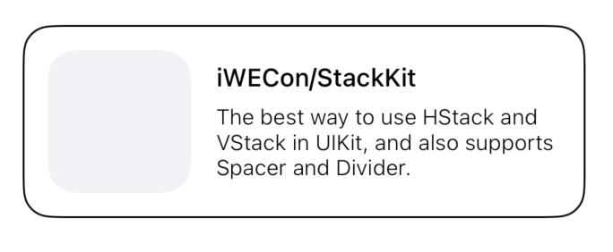
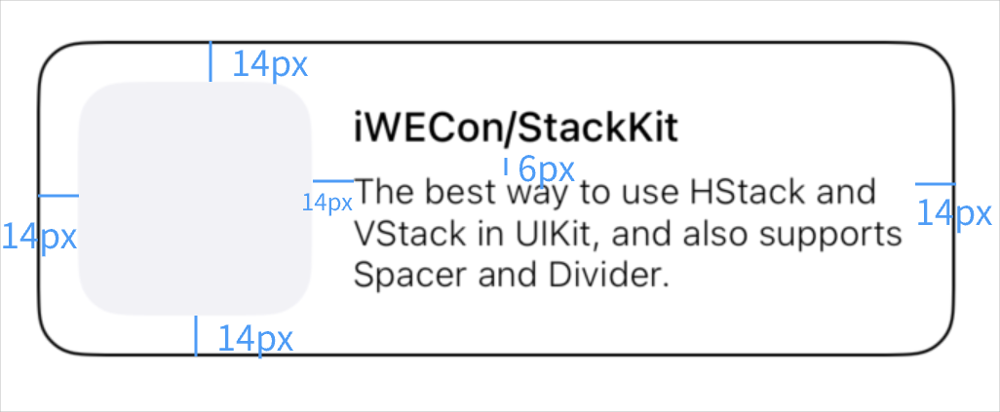

# StackKit

☝️ A layout library similar to SwiftUI.

⚠️ If you have any questions or new ideas, you can bring me a PR at any time.


# Previews and codes


### Preview 1


```swift
HStackView(alignment: .center, distribution: .spacing(14), padding: UIEdgeInsets(top: 14, left: 14, bottom: 14, right: 14)) {
    logoView.stack.size(80)
    VStackView(alignment: .left, distribution: .spacing(6)) {
        nameLabel
        briefLabel.stack.maxWidth(220)
    }
}
```



💡 There are no more examples, you can help to complete/optimize.


### Padding

```swift
HStackView(padding: UIEdgeInsets)
VStackView(padding: UIEdgeInsets)
```

### Subview size is fixed

```swift
logoView.stack.size(CGSize?)
```

### Min or Max width/height

```swift
briefLabel.stack.minWidth(CGFloat?)
                .maxWidth(CGFloat?)
                .minHeight(CGFloat?)
                .maxHeight(CGFloat?)
```

### Offset

```swift
briefLabel.stack.offset(CGPoint?)
                .offset(x: CGFloat?)
                .offset(y: CGFloat?)
```

### SizeToFit

```swift
briefLabel.stack.width(220).sizeToFit(.width)
```

### Spacer & Divider

```swift
VStackView {
    nameLabel
    
    Spacer(length: 2) //< see `Spacer.swift`
    Divider(thickness: 2) // see `Divider.swift`
    
    briefLabel
}
```

### Then

```swift
VStackView {
    briefLabel.stack.then {
        $0.textColor = .red
    }
}
```


### Change and update

```swift
// update text
briefLabel.text = "Bump version to 1.2.2"

// stackContainer means any instance of HStackView or VStackView
stackContainer.setNeedsLayout() // or .sizeToFit() 
```

# 🤔 

I'm not very good at writing documents. If you have the advantages in this regard, please submit PR to me. Thank you very much.


# Installation

```swift
.package(url: "https://github.com/iWECon/StackKit.git", from: "1.0.0")
```
