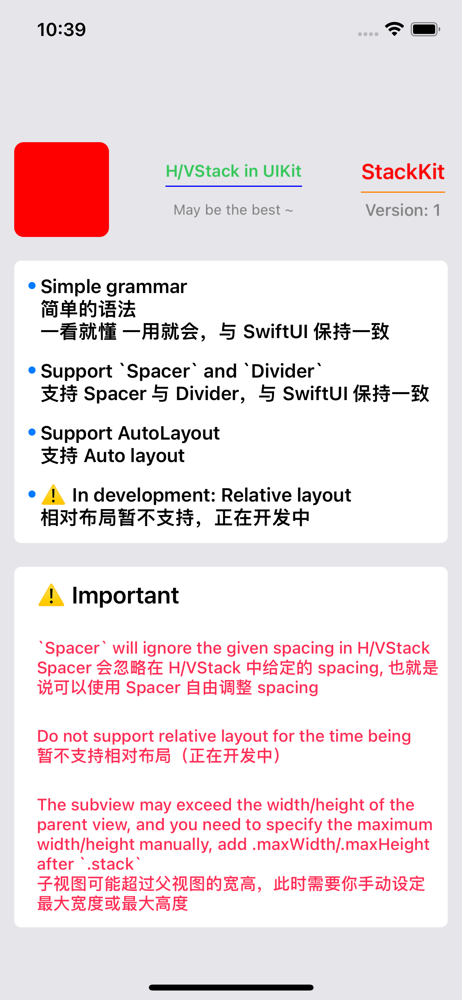

# StackKit

☝️ 一个和 SwiftUI 写法类似的布局库。

⚠️ 有问题或者新灵感随时可以提 PR 给我。

--- 

# Demo

#### Preview


#### Demo Codes
``` 
import UIKit
import StackKit

// 演示代码使用的 PinLayout 而非 SnapKit
// StackKit 内部使用 `view.sizeToFit()` 计算大小, 也是支持 `SnapKit` (AutoLayout)
import PinLayout 

class ViewController: UIViewController {
    
    let content = HStackView {
        Spacer(length: 12)
        
        UIImageView().stack.size(80).then {
            $0.backgroundColor = .red
            $0.layer.cornerRadius = 8
            $0.clipsToBounds = true
        }
        
        // Support Spacer (Inspired by SwiftUI)
        Spacer()
        
        VStackView {
            UILabel().stack.then { label in
                label.font = .systemFont(ofSize: 14, weight: .semibold)
                label.textColor = .systemGreen
                label.text = "H/VStack in UIKit"
            }
            Spacer(length: 4)
            Divider(color: UIColor.blue)
            Spacer(length: 12)
            UILabel().stack.then { label in
                label.font = .systemFont(ofSize: 12, weight: .regular)
                label.textColor = .gray
                label.text = "May be the best ~"
            }
        }
        
        Spacer()
        
        VStackView {
            
            // view.stack.then (Inspired by Then [ https://github.com/devxoul/Then ])
            UILabel().stack.then { label in
                label.text = "StackKit"
                label.font = UIFont.systemFont(ofSize: 18, weight: .semibold)
                label.textColor = .red
            }
            
            Spacer(length: 6)
            // Support Divider (Inspired by SwiftUI)
            Divider(color: UIColor.orange)
            
            Spacer(length: 6)
            
            UILabel().stack.then { label in
                label.text = "Version: 1"
                label.font = UIFont.systemFont(ofSize: 14, weight: .medium)
                label.textColor = .gray
            }
        }
        
        Spacer(length: 12)
    }
    
    let vContent = VStackView(alignment: .left, distribution: .spacing(14)) {
        Spacer(length: 12)
        
        HStackView(alignment: .top) {
            Spacer(length: 12)
            
            VStackView {
                Spacer(length: 6)
                UIView().stack.size(6).then {
                    $0.backgroundColor = .systemBlue
                    $0.layer.cornerRadius = 3
                    $0.clipsToBounds = true
                }
            }
            
            Spacer(length: 4)
            UILabel().stack.then {
                $0.textColor = .darkText
                $0.numberOfLines = 0
                $0.text = "Simple grammar\n简单的语法\n一看就懂 一用就会，与 SwiftUI 保持一致"
                $0.font = .systemFont(ofSize: 16, weight: .semibold)
            }
        }
        
        HStackView(alignment: .top, distribution: .spacing(14)) {
            Spacer(length: 12)
            
            VStackView {
                Spacer(length: 6)
                UIView().stack.size(6).then {
                    $0.backgroundColor = .systemBlue
                    $0.layer.cornerRadius = 3
                    $0.clipsToBounds = true
                }
            }
            
            Spacer(length: 4)
            UILabel().stack.then {
                $0.textColor = .darkText
                $0.font = .systemFont(ofSize: 16, weight: .semibold)
                $0.numberOfLines = 0
                $0.text = "Support `Spacer` and `Divider`\n支持 Spacer 与 Divider，与 SwiftUI 保持一致"
            }
        }
        
        HStackView(alignment: .top, distribution: .spacing(14)) {
            Spacer(length: 12)
            
            VStackView {
                Spacer(length: 6)
                UIView().stack.size(6).then {
                    $0.backgroundColor = .systemBlue
                    $0.layer.cornerRadius = 3
                    $0.clipsToBounds = true
                }
            }
            
            Spacer(length: 4)
            UILabel().stack.then {
                $0.textColor = .darkText
                $0.font = .systemFont(ofSize: 16, weight: .semibold)
                $0.numberOfLines = 0
                $0.text = "Support AutoLayout\n支持 Auto layout"
            }
        }
        
        HStackView(alignment: .top, distribution: .spacing(14)) {
            Spacer(length: 12)
            
            VStackView {
                Spacer(length: 6)
                UIView().stack.size(6).then {
                    $0.backgroundColor = .systemBlue
                    $0.layer.cornerRadius = 3
                    $0.clipsToBounds = true
                }
            }
            
            Spacer(length: 4)
            UILabel().stack.then {
                $0.textColor = .darkText
                $0.font = .systemFont(ofSize: 16, weight: .semibold)
                $0.numberOfLines = 0
                $0.text = "⚠️ In development: Relative layout\n相对布局暂不支持，正在开发中"
            }
        }
        
        Spacer(length: 12)
    }
    
    let descriptionContent = VStackView {
        Spacer(length: 12)
        HStackView {
            Spacer(length: 12)
            
            VStackView(alignment: .left, distribution: .spacing(24)) {
                UILabel().stack.then {
                    $0.font = .systemFont(ofSize: 20, weight: .semibold)
                    $0.text = "⚠️ Important"
                }
                UILabel().stack.maxWidth(UIScreen.main.bounds.width - 48).then {
                    $0.textColor = .systemPink
                    $0.font = .systemFont(ofSize: 14, weight: .medium)
                    $0.numberOfLines = 0
                    $0.text = "`Spacer` will ignore the given spacing in H/VStack\nSpacer 会忽略在 H/VStack 中给定的 spacing, 也就是说可以使用 Spacer 自由调整 spacing"
                }
                
                UILabel().stack.then {
                    $0.textColor = .systemPink
                    $0.font = .systemFont(ofSize: 14, weight: .medium)
                    $0.numberOfLines = 0
                    $0.text = "Do not support relative layout for the time being\n暂不支持相对布局（正在开发中）"
                }
                
                // specify `.maxWidth`
                UILabel().stack.maxWidth(UIScreen.main.bounds.width - 48).then {
                    $0.textColor = .systemPink
                    $0.font = .systemFont(ofSize: 14, weight: .medium)
                    $0.numberOfLines = 0
                    $0.text = "The subview may exceed the width/height of the parent view, and you need to specify the maximum width/height manually, add .maxWidth/.maxHeight after `.stack`\n子视图可能超过父视图的宽高，此时需要你手动设定最大宽度或最大高度"
                }
            }
        }
        Spacer(length: 12)
    }
    
    override func viewDidLoad() {
        super.viewDidLoad()
        
        view.backgroundColor = .systemGray5
        
        vContent.backgroundColor = .white
        vContent.layer.cornerRadius = 6
        
        descriptionContent.backgroundColor = .white
        descriptionContent.layer.cornerRadius = 6
        
        view.addSubview(content)
        view.addSubview(vContent)
        view.addSubview(descriptionContent)
    }
    
    override func viewDidLayoutSubviews() {
        super.viewDidLayoutSubviews()
        
        content.pin.top(120).horizontally().sizeToFit(.width)
        vContent.pin.below(of: content).horizontally(12).marginTop(20).sizeToFit(.width)
        descriptionContent.pin.below(of: vContent).horizontally(12).marginTop(20).sizeToFit(.width)
    }
}
```

##### 一些特殊说明

`isHidden || alpha <= 0 || (frame.size == .zero && clipsToBounds == true)` 这样的 UIView 不会被显示也不会占用位置。（在 CALayer 中一致）

# 类说明

* `HStackView` / `VStackView`
 
UIView 子类，正常用法：`view.addSubview(_:)` 即可，自动计算 size，调用 `view.sizeToFit()`，添加的子视图可使用 AutoLayout 或 frame 配置 size。


* `Divider` / `Spacer`

从 SwiftUI 吸取的灵感。可以用在 HStackView 和 VStackView 中。


* `WrapStackView`

UIView 子类，是个类似 Grid / Collection 的 View。

```swift
// 关于 verticalAlignment 和 horizontalAlignment 查看 Enums.swift 即可，有详细注解

WrapStackView(
    verticalAlignment: .nature, // 从左到右排列
    horizontalAlignment: .center,
    contentInsets: .zero,
    itemSpacing: 10,
    lineSpacing: 10,
    itemSize: .adaptive(column: 4) // 自动排列，每行 4 个
)
```


#### ⚠️ 下面两个应该不常用，简单说一下：仅作为静态展示使用

* Layer 的用法与 View 一致，参数都一样，只是从 UIView 变成了 CALayer。

* `HStackLayer` / `VStackLayer`

这两个是 CALayer 的子类，用来作静态展示时用的。


* `HStackLayerWrapperView` / `VStackLayerWrapperView`

这两个是 UIView 的之类，但是添加 UIView 进去的时候，会被转换成 CALayer 进行显示，也是用来做静态布局。

--- 

emmm... 配图啥的有空的时候我再传，现在自己测试过也在项目里用了，么得问题。


# 安装方式

现在就 SwiftPM，有 Pod 需求的可以提 PR，不然我也懒。因为这个布局都是硬算的，没有用其他第三方，作为独立的库，我觉得 SwiftPM 省事儿。

```swift
.package(url: "https://github.com/iWECon/StackKit.git", from: "1.0.0")
```
